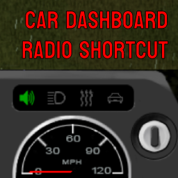

# PZ_CarDashboardRadioButton

Adds a radio button to the card dashboard element. Clicking on it opens the device panel.
The icon is green if radio is currently on, red if the key is in ignition and the radio is missing from the car and gray otherwise.

Workshop ID:
Mod ID: Kaldo_CarDashboardRadioButton
